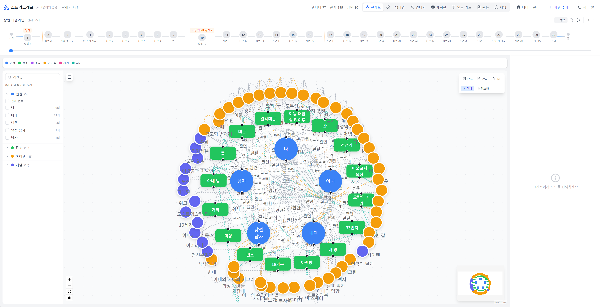
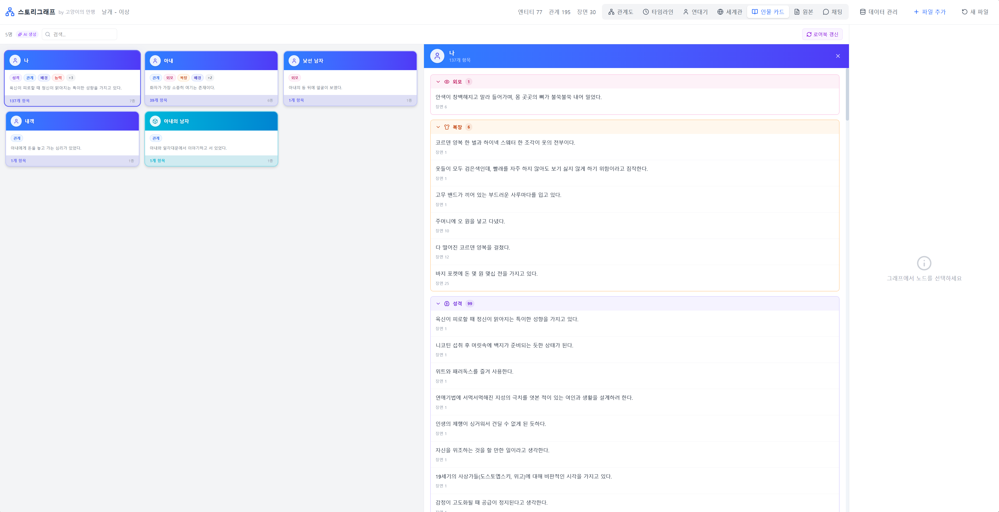
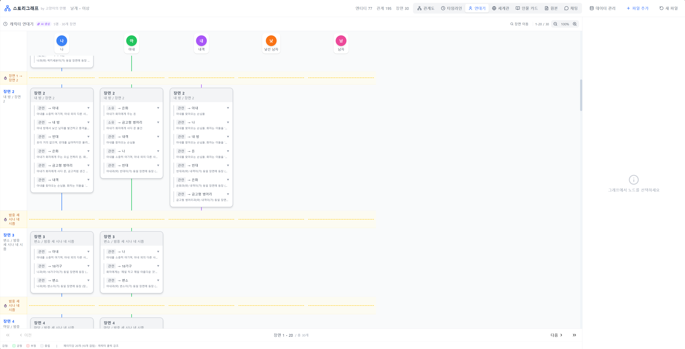
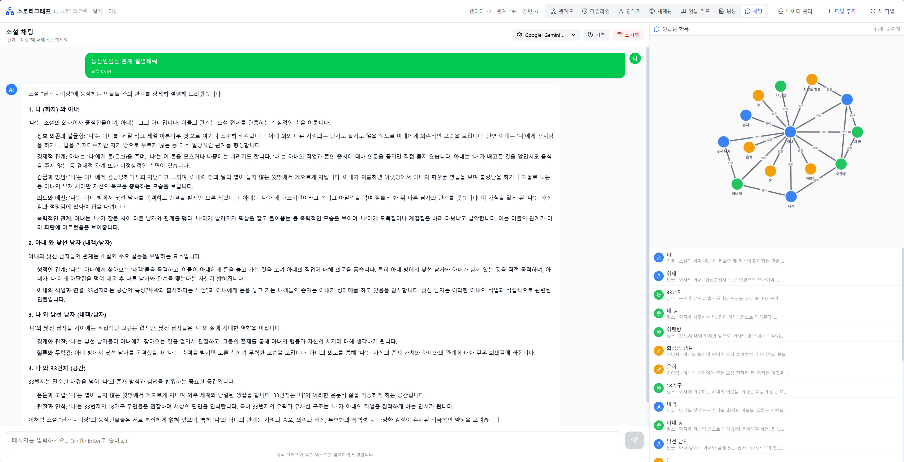

# 소설 인물 관계도 (Character Relationship Chart)

AI가 소설을 분석하여 인물 관계도를 자동으로 생성하는 웹 애플리케이션입니다.

## 주요 기능

### 1. AI 기반 자동 분석
- 소설 텍스트(.txt) 또는 PDF 파일 업로드
- Google Gemini API를 사용한 자동 분석
- 인물, 장소, 조직, 아이템 등 엔티티 추출
- 관계(가족, 연인, 친구, 적대 등) 자동 감지

### 2. 인터랙티브 관계도
- 드래그로 노드 이동 가능
- 노드 클릭 시 상세 정보 패널 표시
- 인물 중심 모드 (다중 선택 지원)
- 중요도 필터링
- 간소화 모드 (인물만 표시)

### 3. 연대기 뷰
- 장면별 캐릭터 이벤트 타임라인
- 드래그로 스크롤
- 시간 경과 표시
- 감정별 색상 구분 (긍정/부정/중립)

### 4. 데이터 관리
- 로컬 스토리지 자동 저장
- 버전 히스토리 (이전 버전 복원)
- JSON 내보내기/가져오기
- 파일 추가 분석 (기존 데이터와 병합)

## 설치 및 실행

### 요구 사항
- Node.js 18+
- Google AI API 키 (Gemini)

### 설치

```bash
# 저장소 클론
git clone https://github.com/Catcident/Character-Relationship-Chart.git
cd Character-Relationship-Chart

# 의존성 설치
cd web
npm install
```

### 환경 설정

```bash
# .env 파일 생성
cp .env.example .env

# .env 파일 편집
VITE_GEMINI_API_KEY=your_api_key_here
```

### 실행 (Docker Compose 기반)

```bash
# 모든 환경이 Docker Compose + Caddy 리버스 프록시로 운영됨
cd web
docker compose up --build -d        # 빌드 + 실행
docker compose logs -f storygraph   # 로그 확인
docker compose restart storygraph   # 재시작
```

## 사용 방법

### 1. 소설 분석
1. 웹 페이지에서 "소설 파일을 업로드하세요" 영역 클릭
2. .txt 또는 .pdf 파일 선택
3. AI가 자동으로 분석 (긴 소설은 청크 단위로 처리)
4. 분석 완료 후 관계도 표시

### 2. 관계도 탐색
- **노드 클릭**: 상세 정보 패널 열기
- **노드 드래그**: 위치 이동
- **뷰 모드**:
  - 전체: 모든 엔티티 표시
  - 간소화: 인물만 표시
  - 인물 중심: 선택한 인물 중심으로 필터링 (다중 선택 가능)

### 3. 연대기 보기
- 상단 탭에서 "연대기" 선택
- 마우스 드래그로 상하좌우 스크롤
- 장면별 관계 변화 확인

### 4. 데이터 관리
- **파일 추가**: 헤더의 "파일 추가" 버튼으로 추가 분석
- **저장**: 자동 저장 (버전 관리됨)
- **내보내기**: 저장된 데이터 카드 호버 → 다운로드 아이콘
- **가져오기**: "JSON 가져오기" 버튼

## 기술 스택

- **Frontend**: React 18, TypeScript, Vite
- **UI**: Tailwind CSS, Lucide Icons
- **그래프**: @xyflow/react (React Flow)
- **AI**: Google Gemini API
- **PDF**: pdf.js
- **상태 관리**: Zustand

## 프로젝트 구조

```
Character-Relationship-Chart/
├── web/                     # 웹 애플리케이션
│   ├── src/
│   │   ├── components/      # React 컴포넌트
│   │   │   ├── RelationshipGraph.tsx   # 관계도 그래프
│   │   │   ├── DetailPanel.tsx         # 상세 정보 패널
│   │   │   ├── CharacterChronicle.tsx  # 연대기 뷰
│   │   │   ├── FileUpload.tsx          # 파일 업로드
│   │   │   └── SavedDataGrid.tsx       # 저장 데이터 그리드
│   │   ├── services/
│   │   │   ├── extraction.ts           # AI 분석 서비스
│   │   │   └── storage.ts              # 로컬 스토리지
│   │   ├── store.ts                    # Zustand 상태 관리
│   │   └── types.ts                    # TypeScript 타입 정의
│   └── package.json
├── docs/                    # 문서
│   ├── FEATURES.md          # 기능 상세 설명
│   └── KNOWLEDGE_GRAPH.md   # 지식 그래프 구조 설명
└── README.md
```

## 문서

- [기능 상세 설명](docs/FEATURES.md)
- [지식 그래프 구조](docs/KNOWLEDGE_GRAPH.md)

---

## 스크린샷

### 인물 관계 그래프

<p align="center">
  
</p>

### 인물 카드

<p align="center">
  
</p>

### 연대기

<p align="center">
  
</p>

### 채팅

<p align="center">
  
</p>

---

## 라이선스

MIT License
